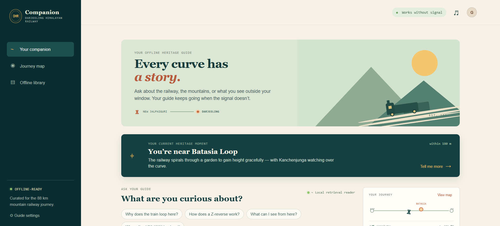
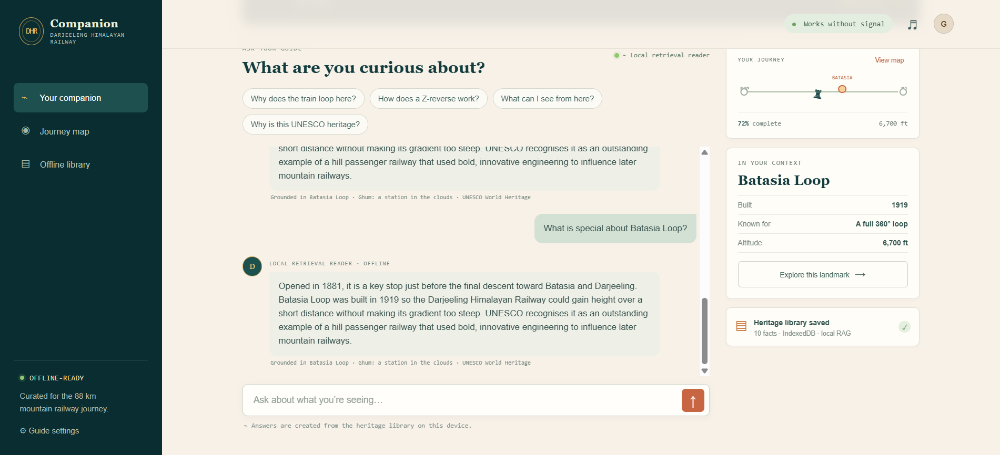

# DHR Companion




An **offline AI heritage companion for the Darjeeling Himalayan Railway (DHR)**. The app turns a train journey into an interactive heritage experience by combining GPS, local retrieval, and on-device AI for use in areas with little or no network connectivity.

Travelers can ask conversational questions about landmarks such as Batasia Loop and Ghum, DHR engineering, locomotives, history, and UNESCO heritage without relying on cloud AI APIs.

## How it works

The companion now follows a real local pipeline:

```text
GPS or demo landmark → local semantic embedding → IndexedDB retrieval + location bias → on-device LLM → answer
```

No request is made to a cloud AI API. The app’s PWA shell, corpus and retrieval engine are cached by the service worker.

## Features

- **Location-aware guidance:** GPS identifies the tourist’s current stretch of the railway, with simulated locations available for demos.
- **Offline local knowledge base:** DHR heritage notes are bundled with the app and indexed in the browser’s IndexedDB database.
- **Local RAG:** Relevant notes are selected using semantic embeddings, synonym normalization, cosine similarity, and geographic or route proximity.
- **On-device answers:** A locally hosted Gemma model can generate conversational answers without sending questions or heritage data to a server.
- **Offline fallback:** When an on-device model is unavailable, a local extractive reader answers from the retrieved source notes.
- **PWA support:** The app shell, corpus, and retrieval engine can continue working after the first load and network disconnect.

## Run

### Requirements

- Node.js 18 or newer
- A modern browser with JavaScript enabled
- Optional: a WebGPU-capable browser and a compatible local Gemma `.litertlm` model for generative answers

### Start the app

```powershell
node server.js
```

Open `http://localhost:4173`. Use **Guide settings** to switch simulated locations or opt into GPS. The app shows a landmark notification when the nearest known DHR point changes.

To run the built-in syntax checks:

```powershell
npm run check
```

## What is genuinely local now

- On first launch, `data/dhr-knowledge.json` is read from the app bundle, vectorized, and persisted in the `dhr-companion-local-rag` IndexedDB database. Subsequent retrieval reads the documents and their vectors from IndexedDB.
- Retrieval uses cosine similarity of local 128-dimensional feature-hashed semantic embeddings, with synonym normalization and geographic/route proximity bias. It is not a keyword-ranking path.
- The answer prompt includes only the selected local source notes and current landmark. The provider is explicitly told not to invent facts outside that context.
- GPS is processed in the browser. The nearest DHR landmark biases retrieval, and the geolocation watch triggers a new heritage-moment card on approach.
- When a generator is unavailable, the app uses a local extractive reader that selects relevant sentences from retrieved notes. It has no cloud dependency and no canned response templates.

## On-device Gemma

`llm-provider.js` contains a production-shaped `MediaPipeGemmaProvider`: it loads the official MediaPipe `FilesetResolver` and `LlmInference`, initializes a locally hosted `.litertlm` Gemma model, and calls `generateResponse()` with the retrieved RAG prompt. It also supports loading a model file selected from the user’s device in **Guide settings**.

A model binary and the MediaPipe browser runtime are intentionally not committed here: web-converted Gemma files are very large and have their own distribution licence. To activate Gemma generation, add these locally (and then load the page once so the service worker caches them):

```text
vendor/mediapipe/genai_bundle.mjs
vendor/mediapipe/wasm/…
models/gemma-3n-E2B-it-int4-Web.litertlm
```

These paths are the defaults in `llm-provider.js`; alternatively choose a downloaded `.litertlm` file in the UI. Browsers with a compatible built-in local Prompt API are also tried. If neither runtime is present, the status honestly reads **Local retrieval reader** and the extractive offline fallback remains active.

Google’s official guide documents that MediaPipe LLM Inference runs models fully on-device in WebGPU-capable browsers, uses `@mediapipe/tasks-genai`, and initializes a local model with `modelAssetPath` / `generateResponse`. The same guide notes that the MediaPipe API is maintenance-mode and recommends LiteRT-LM for new work; the provider boundary keeps that upgrade isolated.

## Privacy and connectivity

The app does not call a cloud AI API. GPS is processed in the browser, and questions are answered from the local knowledge base and any locally installed model. The first launch requires access to the app bundle so the PWA can cache its shell and initialize the local library; after that, the core experience is designed to work offline.

## Demo script

1. Start at the default Batasia Loop position and ask, “Why does the train loop here?”
2. Open **Guide settings**, choose Ghum or Tindharia, and ask the same broad question again. The surfaced sources change because of location-aware semantic retrieval.
3. Open **Offline library** to show the material is labelled IndexedDB/vector-ready.
4. Disconnect after the first load. Simulated location, IndexedDB retrieval, and the installed local model/fallback continue without signal.
